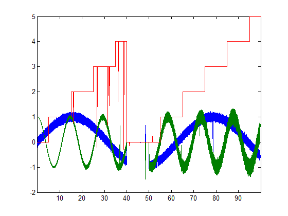

# matlab-plot-big

Makes large MATLAB line plots much faster.

This simple tool intercepts data going into a plot and reduces it to the smallest possible set that looks identical given the number of pixels available on the screen. It then updates the data as a user zooms or pans. This is useful when a user must plot a very large amount of data and explore it visually. 

This works with MATLAB's built-in line plot functions, allowing the functionality of those to be preserved. 

Instead of:

```
plot(t, x);
```

One could use:

```
reduce_plot(t, x);
```

Most plot options, such as multiple series and line properties, can be passed in too, such that 'reduce_plot' is largely a drop-in replacement for 'plot'.

```
h = reduce_plot(t, x(1, :), 'b:', t, x(2, :), t, x(3, :), 'r--*');
```

This function works on plots where the "x" data is always increasing, which is the most common, such as for time series.



For more information, see:

```
>> help LinePlotReducer
```

or

```
>> help reduce_plot
```

or

```
>> help LinePlotExplorer
```

File Exchange page: http://www.mathworks.com/matlabcentral/fileexchange/40790

Thanks for downloading.

Tucker McClure

Copyright 2013-2015, The MathWorks, Inc. and Tucker McClure
